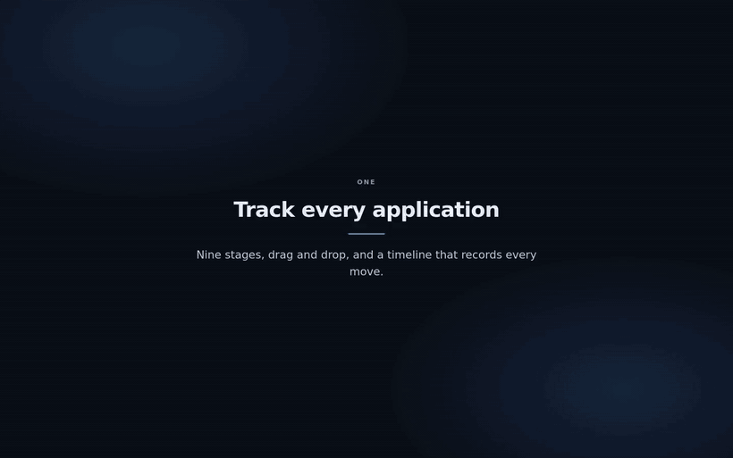

<div align="center">


# Alfred

**Your job-hunt butler.**

Track every application you have in flight, and turn each one into work you can<br>
actually do — a calibrated fit score, a prep plan, and the questions the loop will ask.

[](https://github.com/Unchained-Labs/alfred/actions/workflows/ci.yml)
[](https://unchained-labs.github.io/alfred/)
[](LICENSE)

**[Documentation](https://unchained-labs.github.io/alfred/)** · [Quick start](#quick-start) · [Providers](#bring-your-own-ai) · [Full demo ↓](#demo)



</div>

---

## What it does

|              |                                                                                                                                  |
| ------------ | -------------------------------------------------------------------------------------------------------------------------------- |
| **Track**    | Nine stages, drag and drop, and a timeline recording every move, note and email. Paste a posting and Alfred extracts the fields. |
| **Analyze**  | A fit score calibrated like a hiring manager, with skill-by-skill coverage, the gaps worth closing, and a positioning angle.     |
| **Prepare**  | Coding problems, concepts, system-design prompts and behavioural stories chosen for _that_ role — each with a reason.            |
| **Rehearse** | The questions this loop will probably ask, with answers drafted in your own voice for you to rewrite.                            |
| **Ingest**   | Optional read-only IMAP sync that classifies recruiter mail and matches it to your pipeline.                                     |

It runs locally against SQLite. Nothing leaves your machine except the calls you
configure to an AI provider.

## Quick start

```sh
git clone https://github.com/Unchained-Labs/alfred.git
cd alfred && npm install && npm run dev
```

Open <http://localhost:3000>. The database is created and migrated on first
render — there is no setup step. Requires **Node 22+**.

Want to see it populated first? `npm run seed` loads a demo pipeline
(destructive — it replaces existing data).

Then, in **Settings**: paste your résumé, pick a provider, and add an
application.

## Bring your own AI

One interface, four implementations — switching is a dropdown and nothing else
changes.

| Provider              | Notes                                                                                                                      |
| --------------------- | -------------------------------------------------------------------------------------------------------------------------- |
| **Claude**            | Anthropic API — structured outputs, adaptive thinking, configurable effort                                                 |
| **Local Claude Code** | The `claude` CLI already on your machine. **No API key**, uses your existing sign-in                                       |
| **LLM endpoint**      | Any OpenAI-compatible server: Ollama, vLLM, LM Studio, OpenRouter                                                          |
| **Custom agent**      | Your own agent over HTTP, given a [documented task envelope](https://unchained-labs.github.io/alfred/reference/agent-api/) |

A local endpoint or the local CLI keeps your résumé, the job descriptions and
your mail entirely on your machine.

[Compare the providers →](https://unchained-labs.github.io/alfred/reference/ai-providers/)

## Demo

The loop above is the short version. The full 60-second walkthrough plays on the
**[documentation site](https://unchained-labs.github.io/alfred/#see-it-working)**,
which also has a clip for each section — [the board](https://unchained-labs.github.io/alfred/guide/tracking/),
[fit analysis](https://unchained-labs.github.io/alfred/guide/analysis/),
[prep plans and questionnaires](https://unchained-labs.github.io/alfred/guide/prep/),
[the mailbox](https://unchained-labs.github.io/alfred/guide/mailbox/) and
[providers](https://unchained-labs.github.io/alfred/reference/ai-providers/).

Or [download the MP4](docs/assets/alfred-demo.mp4?raw=1) (1440×900, 4.8 MB).

## Documentation

|                                                                                                                                                                                                                                                                                                                      |                 |
| -------------------------------------------------------------------------------------------------------------------------------------------------------------------------------------------------------------------------------------------------------------------------------------------------------------------- | --------------- |
| [Install](https://unchained-labs.github.io/alfred/getting-started/install/) · [Quick start](https://unchained-labs.github.io/alfred/getting-started/quickstart/)                                                                                                                                                     | Getting running |
| [Tracking](https://unchained-labs.github.io/alfred/guide/tracking/) · [Analysis](https://unchained-labs.github.io/alfred/guide/analysis/) · [Prep](https://unchained-labs.github.io/alfred/guide/prep/) · [Mailbox](https://unchained-labs.github.io/alfred/guide/mailbox/)                                          | Using it        |
| [Providers](https://unchained-labs.github.io/alfred/reference/ai-providers/) · [Agent API](https://unchained-labs.github.io/alfred/reference/agent-api/) · [Architecture](https://unchained-labs.github.io/alfred/reference/architecture/) · [Security](https://unchained-labs.github.io/alfred/reference/security/) | Reference       |

## Contributing

Issues and pull requests welcome — see [CONTRIBUTING.md](CONTRIBUTING.md). Run
`make check` before pushing.

> **A note on secrets.** API keys and your mailbox password are stored in
> plaintext in `data/alfred.db` (gitignored). That's a deliberate trade for a
> single-user local tool, and it means the file is as sensitive as what's in it.
> Set `ANTHROPIC_API_KEY`, `ALFRED_LLM_API_KEY` or `ALFRED_AGENT_API_KEY` in the
> environment to avoid storing them at all — the environment wins.
> [Security model →](https://unchained-labs.github.io/alfred/reference/security/)

## License

MIT © 2026 Erwin Lejeune and contributors
