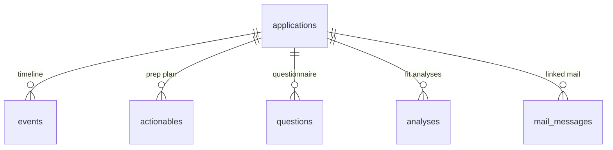
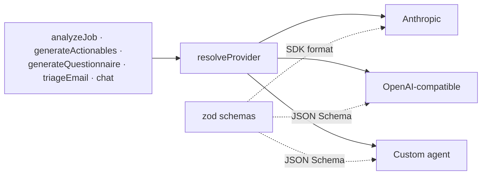

# Architecture

Alfred is a single-user Next.js app over local SQLite. There is no server
component beyond the one serving your own browser.

## Layout

```
src/
├── app/                  # App Router — pages and API routes
├── components/
│   ├── ui/               # Primitives (Radix-backed)
│   ├── charts/           # Stat tiles, funnel, activity, meters, skill bars
│   ├── shell/            # Sidebar, topbar, command palette
│   └── …                 # applications/ dashboard/ prep/ inbox/ settings/
├── db/                   # Drizzle schema and client
└── lib/
    ├── ai/               # Provider interface, providers, prompts, schemas
    ├── mail/             # IMAP client and sync/triage
    ├── queries.ts        # Reads
    ├── mutations.ts      # Writes, with timeline events
    └── settings.ts       # Settings store and redaction
```

## Data model



`analyses` is append-only — re-running keeps the history, and the application
page shows the latest. `events` is the timeline, and the conversion funnel is
derived from it rather than from current stage, so applications that were later
rejected still count toward every stage they cleared.

## Reads and writes

Pages are server components calling `queries.ts` directly — no API round trip for
rendering. Mutations go through API routes so the client can act on the result,
and every write that changes an application's state records a timeline event in
the same call.

## The AI layer



Operations never talk to a provider directly; they describe what they want —
a system prompt, a user prompt and a schema — and the resolved provider decides
how to get it. That's why adding a provider requires no change to any operation.

## Rendering and state

Every page is `force-dynamic`: the data is local, queries are sub-millisecond,
and a stale cache on a job tracker is worse than a fresh read.

Two client-state rules worth knowing if you're contributing:

- **Nothing time-dependent is computed during render.** `Date.now()` in render is
  impure and the server and browser disagree about it, so "overdue" styling comes
  from `useNow()`, which resolves after mount and refreshes on an interval.
- **Derived state is adjusted during render, not in an effect.** Board cards, the
  stage picker and the form reset compare against a previous-value state and
  correct immediately, so a server refresh never paints one stale frame.

## Charts

Colour is assigned by the job it does, not by taste:

| Encoding        | Used for                  | Rule                                                  |
| --------------- | ------------------------- | ----------------------------------------------------- |
| **Ordinal**     | Pipeline stages           | One hue, stepped — the order is visible in the colour |
| **Categorical** | Actionable kinds          | Fixed palette slots, assigned in order, never cycled  |
| **Status**      | Fit score, skill coverage | Reserved colours, always with an icon or text label   |

Both themes were validated against Alfred's own surfaces rather than eyeballed,
and every low-contrast hue ships a visible text label.
